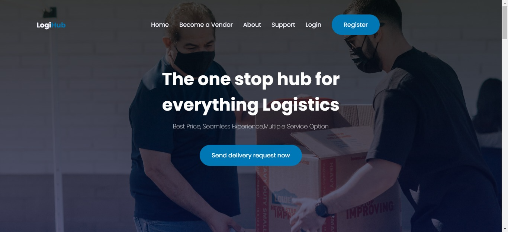

# LogiHub
> LogiHub is a logistic solution that easily connect people to the closest and reliable Logistic Agent.
> Live demo [_here_](https://timmydee.github.io/LogisticHub/). <!-- If you have the project hosted somewhere, include the link here. -->

## Table of Contents
* [General Info](#general-information)
* [Technologies Used](#technologies-used)
* [Features](#features)
* [Screenshots](#screenshots)
* [Project Status](#project-status)
* [Room for Improvement](#room-for-improvement)
* [Acknowledgements](#acknowledgements)
* [Contact](#contact)
<!-- * [License](#license) -->

## General Information
- LogiHub is a logistic solution that easily connect people to the closest and reliable Logistic Agent.
- What problem does it (intend to) solve?
- What is the purpose of your project?
- Why did you undertake it?
<!-- You don't have to answer all the questions - just the ones relevant to your project. -->

## Technologies Used
- Javascript
- Html/Css
- Firebase

## Features
List the ready features here:
- The user experience is Superb
- Users can SignUp/ LogIn to the site
- Users can select their current position and destination

## Screenshots

<!-- If you have screenshots you'd like to share, include them here. -->

## Project Status
Project is: _in progress_.

## Room for Improvement

Room for improvement:
- The user Registration Process

To do:
- A map feature needs to be added
- The payment platforms needs to be embeded to the site

## Acknowledgements
Give credit here.
- This project was inspired by Product Managers @EnovaLabs

## Contact
Created with by ❤️ [@Dahunsi_Timmy](dahunsitimmy@gmail.com) - feel free to contact me!

